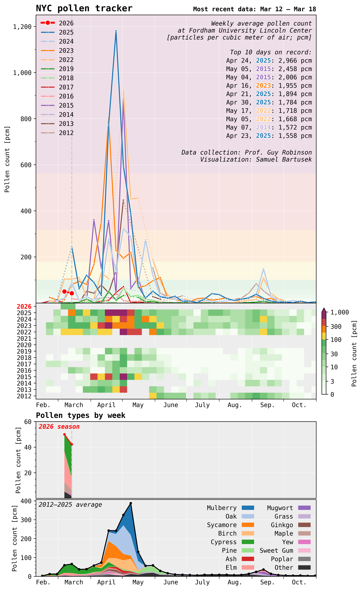

<link rel="shortcut icon" type="image/png" href="/favicon.png?">

  

Bless you! These charts visualize data from the only source of actual pollen measurements in NYC, performed at Fordham University Lincoln Center campus by Dr. Guy Robinson. Due to the underlying noisiness of the data, weekly averages are shown, so this is usually not live up to the day. Visualization is done by Dr. Samuel Bartusek, a climate scientist in NYC. Please visit https://www.fordham.edu/about/campuses/the-louis-calder-center/research/indices/fordham-pollen-index/, or contact Guy Robinson (grobinson at fordham dot edu) or Samuel Bartusek (samuel.bartusek at columbia dot edu) if you are curious about anything.
